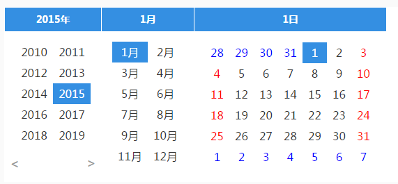
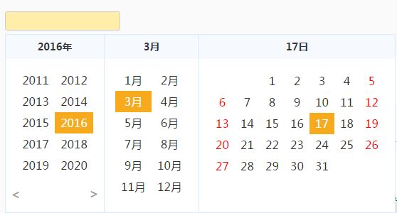

# My Calendar V 1.0.1 #

> 2016/2/29 12:15:17

## Update Log

	更新日志：
	V 0.0.1——修复最大值，最小值为Function时多次调用；DATE:2016-04-27
	
	V 0.0.2——最大值小于当前日期或最小值大于当前日期时，以最大值或最小值为当前时间；DATE:2016-04-27
	
	V 0.0.3——1：修复目标元素附上冒泡事件；
		   2：调整获取TOP的方式，添加动态获取，即为function 方式；
## quote ##
<pre>
&lt;link rel="stylesheet" href="http://static.huizecdn.com/js/plugins/my-calendar/stylesheets/calendar.css"&gt;
&lt;script src="http://static.huizecdn.com/js/plugins/my-calendar/build/my-calendar.min.js"&gt;&lt;/script&gt;
</pre>
### OR ###
<pre>
&lt;link rel="stylesheet" href="/stylesheets/calendar.css"&gt;
&lt;script src="/build/my-calendar.min.js"&gt;&lt;/script&gt;
</pre>
## DEMO ##
<pre>
//完整Demo
var c1 = new MyCalendar({
	skin: 'calendar-ui', //皮肤
	autoClose: false, //自动关闭
	el: $$('calendar1'), //触发的元素
	readOnly: true, //el只读
	parent: $$('box'),
	autoSetPosition: false, //自动设置位置，一般与parent一起用
	left: 0, //距离el left的位置，位置px
	top: 5, //距离el top的位置，位置px
	showAllDate: true, //显示所有日期，包括上个月、下个月
	defaultValue: '2015-01-01', //默认值
	maxDate: '2026-10-12', //日期范围控制-最大日期
	minDate: '2010-01-01', //日期范围控制-最小日期
});
//c1.open(); //手动打开
//c1.close(); //手动关闭
</pre>
 
# 预览 #

